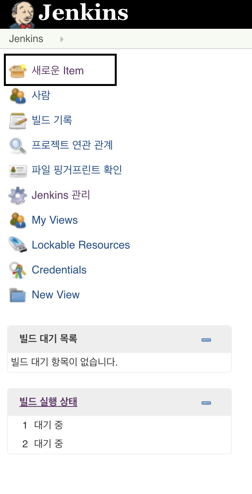
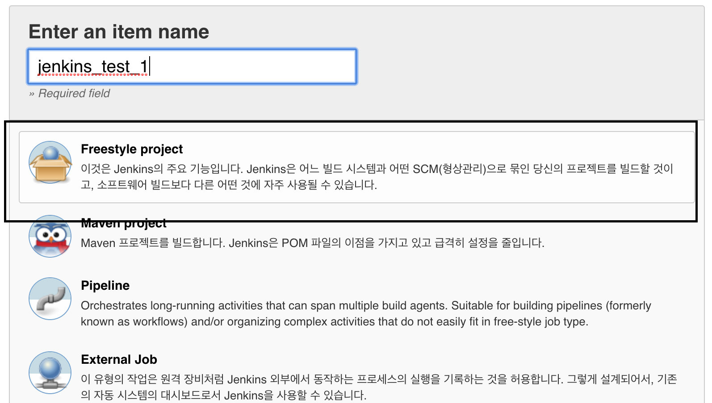
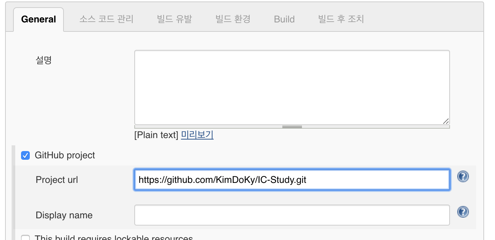
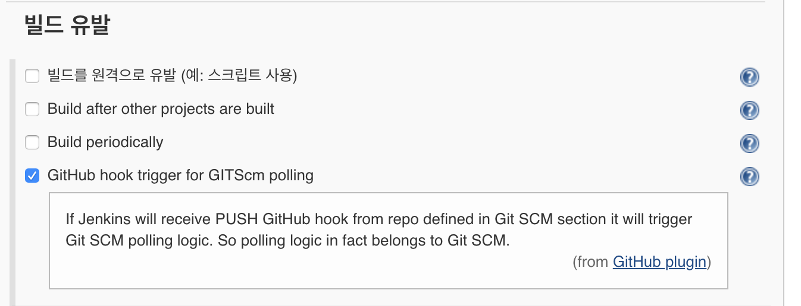

# [Jenkins](https://jenkins.io/)

> 공부자료: [[XECon2016] Github + Jenkins + Docker](https://www.slideshare.net/xpressengine/xecon2016-a4-github-jenkins-docker)

## Install and Start
[**Install for macOS**](https://jenkins.io/download/lts/macos/)  

- install the latest LTS version: `brew install jenkins-lts`  
- install a specific LTS version: `brew install jenkins-lts lts@VERSION`  
- start the jenkins servic: `brew services start jenkins-lts`  
- restart the jenkins service: `brew services restart jenkins-lts`

basic port: 8080

### Create Project

#### Connect Github

